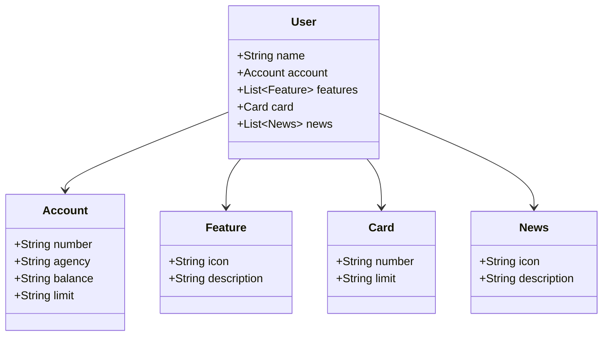

## Projeto Diagrama de classes

```mermaid

classDiagram
    class User {
        +String name
        +Account account
        +List~Feature~ features
        +Card card
        +List~News~ news
    }

    class Account {
        +String number
        +String agency
        +String balance
        +String limit
    }

    class Feature {
        +String icon
        +String description
    }

    class Card {
        +String number
        +String limit
    }

    class News {
        +String icon
        +String description
    }

    User --> Account
    User --> Feature
    User --> Card
    User --> News


```
